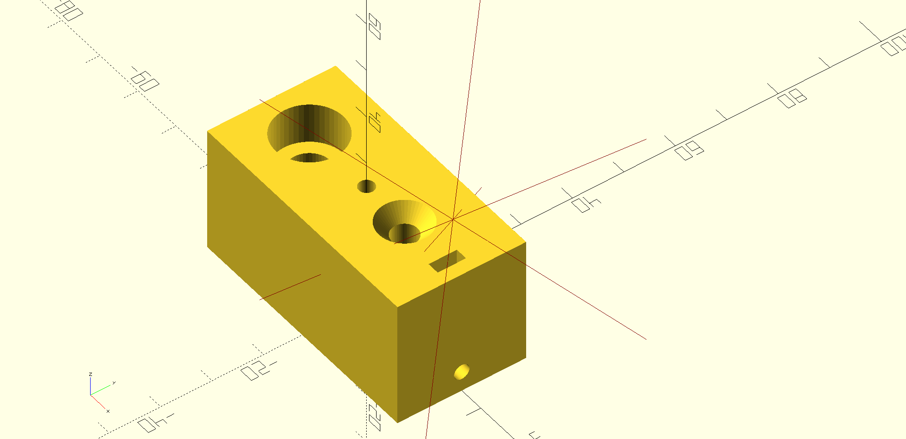

# catchnhole
Because `nutsnbolts` was taken.

An ergonomic way to create nutcatches, screw holes and countersinks in OpenSCAD.

.

## Requirements and installation
`catchnhole` uses OpenSCAD's JSON import, which is only present in the nightly
build, and must be enabled.

Add a git submodule to your project:

```sh
git submodule add https://github.com/mmalecki/catchnhole catchnhole
```

## Usage
```openscad
use <catchnhole/catchnhole.scad>;

difference () {
  translate([-5, -5, 0]) cube([10, 10, 10]);

  // Draw a nutcatch parallel to bolt shaft:
  nutcatch_parallel("M3");
  // Draw a bolt gripping the nutcatch:
  bolt("M3", length = 10);

  // Or, draw a nutcatch sidecut into the part:
  translate([0, 0, 4]) {
    nutcatch_sidecut("M3");
    // Draw a bolt gripping the nutcatch:
    bolt("M3", length = 6);
  }
}
```
For more advanced usage, see the [`examples` directory](./examples).

### API

#### `bolt(name, length, kind = "headless", head_diameter_clearance = 0.1, countersink = 0)`
Draw a bolt up the Z axis, with head at the top.

Arguments:
  * `name` (string) - name of the bolt, e.g. `"M3"`
  * `length` (number) - length of the bolt
  * `kind` (string) - the kind of the bolt, available values:
    * `"headless"` - no bolt head
    * `"socket_head"` - socket head cap (ISO 4762)
    * `"countersunk"` - countersunk head (ISO 10642)
  * `head_diameter_clearance` - how much clearance to leave for the bolt head, where applicable
  * `countersink` (number) - how much to "countersink" the bolt - move it down by the `countersink` * bolt head length

### `nutcatch_parallel(name, height_clearance = 0)`
Draw a nutcatch parallel to the bolt axis.

Arguments:
  * `name` (string) - name of the nut, e.g. `"M3"`
  * `height_clearance` (number) - additional nut height clearance

### `nutcatch_sidecut(name, height_clearance = 0)`
Draw a nutcatch sidecut into the part:

Arguments:
  * `name` (string) - name of the nut, e.g. `"M3"`
  * `height_clearance` (number) - additional nut height clearance

## Acknowledgements
* The [authors](https://github.com/boltsparts/BOLTS/graphs/contributors) of the [BOLTS](https://github.com/boltsparts/BOLTS) library
