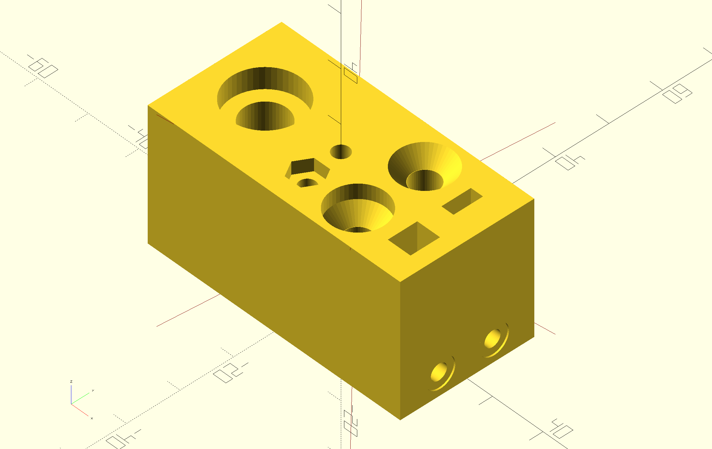

# catchnhole
Because `nutsnbolts` was taken.

An ergonomic way to create nutcatches, screw holes and countersinks in OpenSCAD.

.

## Installation
Add a git submodule to your project:

```sh
git submodule add https://github.com/mmalecki/catchnhole catchnhole
```

## Usage
```openscad
use <catchnhole/catchnhole.scad>;
```
